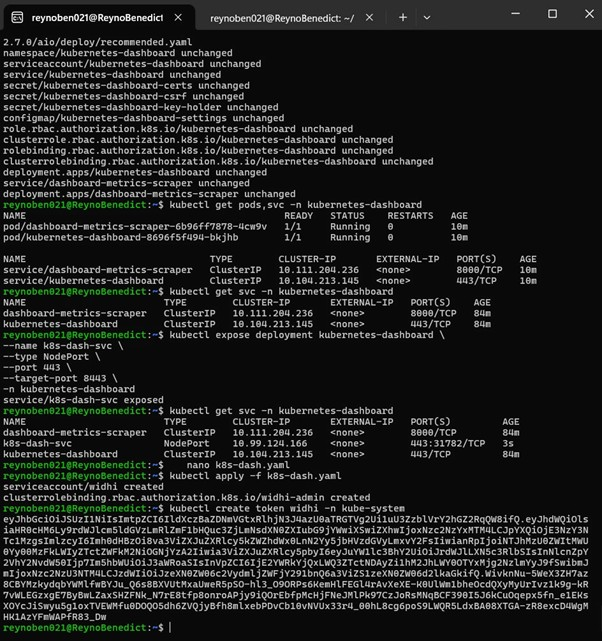
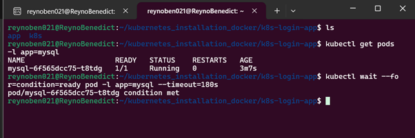
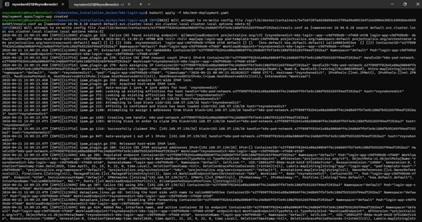
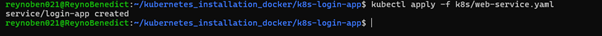
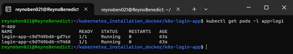
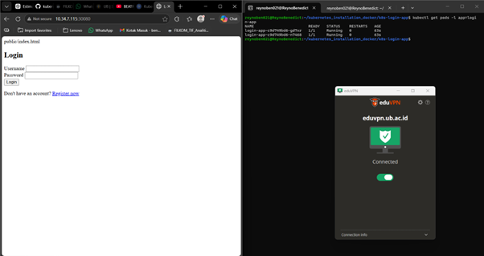
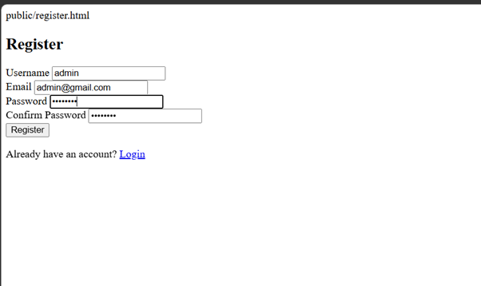
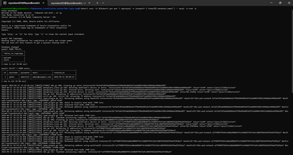
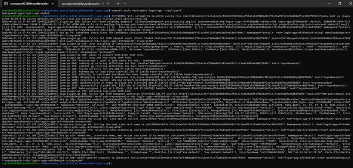
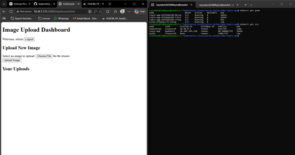

# Dokumentasi Percobaan Deployment Aplikasi di Kubernetes

**Referensi:**

- [README.md - Kubernetes Installation](https://github.com/Widhi-yahya/kubernetes_installation_docker/blob/master/README.md)

- [DEPLOYMENT.md - Web App Deployment](https://github.com/Widhi-yahya/kubernetes_installation_docker/blob/master/DEPLOYMENT.md)

---

## 1. Konfigurasi Kubernetes Dashboard

Langkah awal yang dilakukan dalam proses ini adalah menerapkan konfigurasi pada Kubernetes Dashboard agar dapat berfungsi dengan baik dan terhubung secara optimal dengan cluster Kubernetes, kemudian layanan dashboard tersebut diekspos menggunakan tipe `NodePort` sehingga memungkinkan akses dari luar cluster melalui alamat IP node dan port tertentu yang telah ditentukan, serta dilanjutkan dengan pembuatan token autentikasi yang memiliki hak akses administrator guna memastikan bahwa pengguna yang mengakses dashboard dapat melakukan pengelolaan cluster secara penuh melalui antarmuka yang tersedia dengan tetap memperhatikan aspek keamanan.

## 2. Deployment Database (MySQL)

Langkah berikutnya adalah memastikan ketersediaan layanan _backend_ dengan melakukan deployment database MySQL. Kita perlu menunggu hingga kondisi pod MySQL sepenuhnya `Ready` sebelum mengaktifkan layanan web.

## 3. Apply Web Application Configurations (Login App)

Setelah database siap, dilanjutkan dengan mengaplikasikan manifest untuk aplikasi web.

Pertama, mengaplikasikan konfigurasi deployment aplikasi:

Kedua, mengaplikasikan konfigurasi service agar aplikasi web dapat diakses:

Ketiga, memverifikasi status pod untuk memastikan _login-app_ sudah berjalan di dalam cluster. Pada tahap ini, terdapat 2 replika pod yang sedang berjalan.

## 4. Uji Coba Akses Aplikasi (Browser)

Mengakses halaman antarmuka aplikasi melalui browser web pada port `30080` (NodePort). Koneksi dilakukan dengan bantuan akses jaringan kampus (eduVPN UB) untuk menjangkau IP Node server. Halaman pertama yang diuji adalah halaman **Login**.

Selanjutnya, menguji fungsionalitas aplikasi dengan mencoba mendaftarkan pengguna baru pada halaman **Register** (menggunakan kredensial _admin_).

## 5. Verifikasi Integritas Database

Untuk memastikan bahwa sistem telah terhubung dengan baik, dilakukan proses verifikasi dengan mengakses langsung ke dalam pod MySQL menggunakan perintah `kubectl exec`. Melalui langkah ini, dapat dilakukan pengecekan kondisi database secara langsung, khususnya pada tabel `users`, yang menunjukkan bahwa data registrasi akun admin telah berhasil tersimpan dengan benar, sehingga membuktikan bahwa integrasi antara aplikasi dan database berjalan sesuai dengan yang diharapkan.

## 6. Scaling Deployment Aplikasi

Untuk menguji skalabilitas cluster, dilakukan proses _scaling up_ pada deployment `login-app` sehingga jumlah replika bertambah menjadi 3 pod (`--replicas=3`).

## 7. Hasil Akhir & Image Upload Dashboard

Verifikasi akhir menunjukkan pengguna berhasil masuk (login) dan diarahkan ke halaman **Image Upload Dashboard**. Bersamaan dengan itu, pemantauan melalui terminal mengonfirmasi bahwa ketiga replika pod _login-app_ kini berjalan dengan stabil, beserta informasi IP dan Port dari masing-masing service yang aktif.

Dokumentasi_Deployment_K8s.md
Menampilkan Dokumentasi_Deployment_K8s.md.
